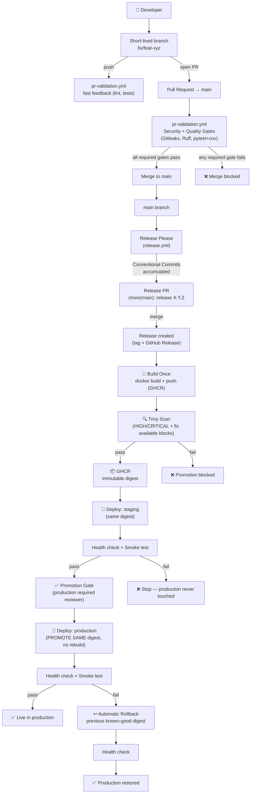
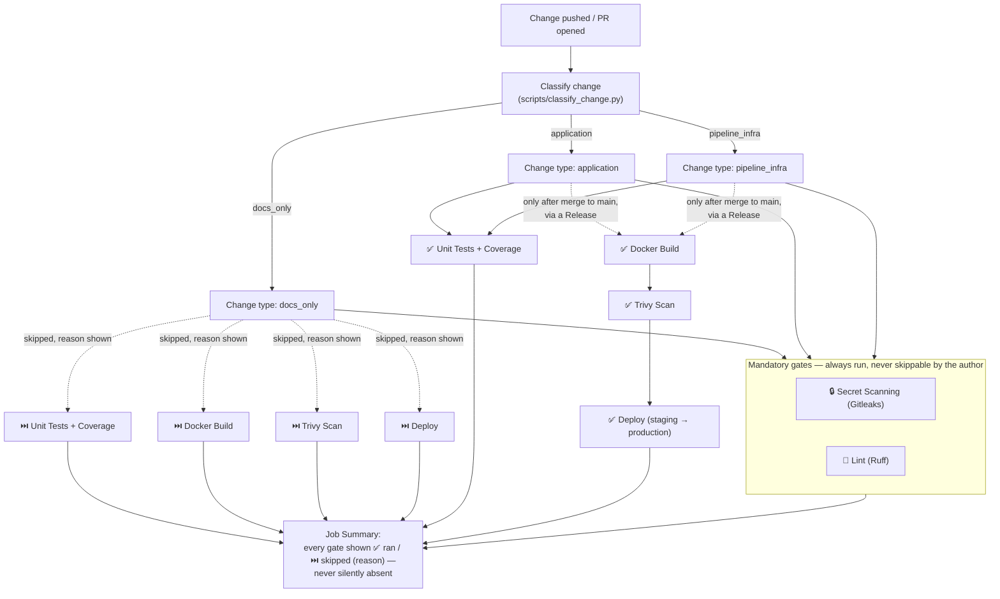

# cicd-devsecops-demo

🚀 **A live conference demo of a modern CI/CD / DevSecOps pipeline** — from a developer's first
commit to a verified production deployment, with security gates that cannot be bypassed, a
dynamic pipeline that only runs what a change actually needs, and one immutable artifact built
once and promoted unchanged from staging to production.

This README is written so another engineer can reproduce the entire demo without any other
context. If you just want the 10–15 minute talk track, jump to the
[🎤 Conference Runbook](#-conference-runbook).

## Contents

- [Objective](#objective)
- [Architecture](#architecture)
- [Prerequisites](#prerequisites)
- [Local installation](#local-installation)
- [Local tests](#local-tests)
- [Docker](#docker)
- [Git strategy](#git-strategy)
- [CI/CD events](#cicd-events)
- [The PR pipeline](#the-pr-pipeline)
- [The main pipeline (release chain)](#the-main-pipeline-release-chain)
- [The dynamic, policy-based pipeline](#the-dynamic-policy-based-pipeline)
- [Versioning and release automation](#versioning-and-release-automation)
- [Container registry](#container-registry)
- [Staging and production](#staging-and-production)
- [Deployment platform](#deployment-platform)
- [Security](#security)
- [Secrets and variables](#secrets-and-variables)
- [Rollback](#rollback)
- [Troubleshooting](#troubleshooting)
- [🎤 Conference Runbook](#-conference-runbook)
- [🆘 Emergency Demo Plan](#-emergency-demo-plan)
- [Determinism & Risk Register](#determinism--risk-register)
- [Architecture Decision Records](#architecture-decision-records)
- [Possible Enhancements](#possible-enhancements)

## Objective

Teach, live, the difference between concepts that are often conflated: CI vs. CD, a PR check vs.
a merge to `main`, a release vs. a deployment, an artifact vs. an environment, a quality gate vs.
a security gate, a health check vs. a smoke test, a promotion vs. a rollback. The full design
process (specification → clarification → plan → tasks → implementation) lives under
[`specs/001-cicd-devsecops-demo/`](specs/001-cicd-devsecops-demo/), produced with
[Spec Kit](https://github.com/github/spec-kit); start there for the *why* behind every decision
below.

## Architecture



(Source: [`docs/diagrams/pipeline.mmd`](docs/diagrams/pipeline.mmd); the dynamic/policy diagram
is under [The dynamic, policy-based pipeline](#the-dynamic-policy-based-pipeline).)

**Components**: a Flask status app (`app/`); GitHub Actions workflows
(`.github/workflows/`) that orchestrate but delegate real logic to `scripts/`; GHCR as the
container registry; two AWS EC2 instances (staging, production) reached via SSM Run Command
(no SSH); GitHub Environments for staging/production config and the production approval gate;
GitHub Deployments API as the system of record for "what's running where," which also drives
rollback.

## Prerequisites

- Python 3.13
- Docker (for the container/Emergency-Demo-Plan path)
- Bandit and pip-audit come via `pip install -e ".[dev]"` (see below) — same tier as pytest/Ruff,
  not a separate install
- Optional, for full local validation: [Gitleaks](https://github.com/gitleaks/gitleaks),
  [Trivy](https://github.com/aquasecurity/trivy), [shellcheck](https://www.shellcheck.net/),
  [actionlint](https://github.com/rhysd/actionlint); `docker pull ghcr.io/zaproxy/zaproxy:2.17.0`
  ahead of time if you want the local DAST stage to run in the Emergency Demo Plan

## Local installation

```bash
python3 -m venv .venv && . .venv/bin/activate
pip install -e ".[dev]"
```

## Local tests

```bash
ruff check .
pytest --cov=app --cov-report=term-missing
```

`pyproject.toml` enforces an 80% coverage floor (`[tool.coverage.report] fail_under = 80`).

## Docker

```bash
docker build \
  --build-arg APP_VERSION=1.0.0 \
  --build-arg GIT_SHA="$(git rev-parse --short HEAD)" \
  --build-arg BUILD_TIME="$(date -u +%Y-%m-%dT%H:%M:%SZ)" \
  -t cicd-devsecops-demo:local .

docker run -d --name demo -p 8080:8080 -e ENVIRONMENT=local cicd-devsecops-demo:local
curl -s localhost:8080/health | python3 -m json.tool
```

The image runs as a non-root user, has a `HEALTHCHECK` against `GET /health`, and never bakes in
`ENVIRONMENT`/`ARTIFACT_DIGEST` (those are run-time `-e` vars — see
[data-model.md](specs/001-cicd-devsecops-demo/data-model.md#versionmetadata) — so the *same*
image is what gets promoted across environments).

## Git strategy

**Trunk-based development** ([ADR-backed constitution Principle
IV](.specify/memory/constitution.md)): `main` is always releasable; work happens on short-lived
branches (`fix/...`, `feat/...`) merged via reviewed Pull Requests. No `develop`/`release`
branches. See [`docs/branch-protection.md`](docs/branch-protection.md) for the exact required
checks and rule configuration on `main` (manual GitHub setup step).

## CI/CD events

| Event | Workflow | What happens |
|---|---|---|
| `push` to a non-`main` branch | `pr-validation.yml` | Fast feedback: same gates as a PR |
| `pull_request` → `main` | `pr-validation.yml` | Quality + security gates, required to merge |
| `push`/merge to `main` | `release.yml` | Release Please → build once → scan → staging → production |
| `push` to `main`, weekly schedule, or `workflow_dispatch` | `codeql.yml` | CodeQL SAST pass, deep but deliberately non-blocking (never on a PR) |
| `workflow_dispatch` on `deploy.yml` | `deploy.yml` | Manual promote/redeploy of a named digest |
| `workflow_dispatch` on `rollback.yml` | `rollback.yml` | Resolve (or accept) a digest and redeploy it |

Full event→workflow→job contract:
[`specs/001-cicd-devsecops-demo/contracts/pipeline-events.md`](specs/001-cicd-devsecops-demo/contracts/pipeline-events.md).

## The PR pipeline

[`.github/workflows/pr-validation.yml`](.github/workflows/pr-validation.yml): classify the change,
then run Secret Scanning (Gitleaks, always) and Lint (Ruff, always) as mandatory gates, and
Tests + SAST + Dependency Scan (pytest, Bandit, pip-audit) as a conditional gate that always
*appears* but internally skips its expensive steps — with a stated reason in the Job Summary —
for a `docs_only` change. Never builds an image, never deploys. Security tools are co-located by
pipeline stage rather than grouped in a separate file/job — see [ADR
0006](docs/adr/0006-security-tool-placement.md) for why.

## The main pipeline (release chain)

[`.github/workflows/release.yml`](.github/workflows/release.yml): Release Please proposes/updates
a Release PR from Conventional Commits on `main`; merging that PR cuts a release, which is the
only trigger for `build-scan-publish` (the **one** place in this repository that builds and
pushes an image — [ADR 0004](docs/adr/0004-build-once-promote.md)). That image's digest is then
passed, unchanged, to `deploy-staging` and — only if staging passes — `deploy-production`, both
calls to the reusable [`deploy.yml`](.github/workflows/deploy.yml).

## The dynamic, policy-based pipeline



This is **policy-based execution**, not "disable security checks": mandatory gates (secret
scanning) are wired unconditionally in the YAML and never consult the classifier at all — a bug
in `scripts/classify_change.py` can never disable them. Only conditional gates (tests, build,
scan, deploy) read the classification, and every skip is explained, never silent. Logic lives in
`scripts/classify_change.py` (unit-tested in `tests/unit/test_classify_change.py`), not scattered
across YAML `if:` conditions — see
[data-model.md#changeclassification](specs/001-cicd-devsecops-demo/data-model.md#changeclassification).

## Versioning and release automation

SemVer, derived mechanically from [Conventional
Commits](https://www.conventionalcommits.org/) by [Release
Please](https://github.com/googleapis/release-please) — `fix:`→PATCH, `feat:`→MINOR,
`!`/`BREAKING CHANGE:`→MAJOR. No manual version editing anywhere. See [ADR
0002](docs/adr/0002-release-automation.md) for why Release Please was chosen over
semantic-release for this demo. Traceability chain: Commit → Conventional Commit type → Release
PR → Git tag + GitHub Release → image tags (`:X.Y.Z` and `:<git-sha>`) + digest → environment —
visible end-to-end on the app's own status page (`GET /`) and `GET /health`.

## Container registry

GitHub Container Registry, `ghcr.io/eazysec/cicd-devsecops-demo`, public (free for public repos,
authenticates with the ambient `GITHUB_TOKEN`, needs no registry credential on the deploy hosts).
See [ADR 0003](docs/adr/0003-registry.md).

## Staging and production

Modeled as two [GitHub Environments](https://docs.github.com/actions/deployment/targeting-different-environments/using-environments-for-deployment),
each with its own `AWS_ROLE_ARN`, `AWS_REGION`, `EC2_INSTANCE_ID`, `APP_URL` variables (see
[Secrets and variables](#secrets-and-variables)) and its own AWS IAM role scoped to only that
environment's EC2 instance. `production` additionally has a required-reviewer protection rule, so
`deploy-production` pauses for a manual approval click — the live promotion-gate moment. Every
deploy is health-checked and smoke-tested before being considered successful
([contracts/deploy-script.md](specs/001-cicd-devsecops-demo/contracts/deploy-script.md)).

## Deployment platform

AWS EC2 (two `t3.micro` instances, Docker Engine) reached via AWS Systems Manager Run Command —
no SSH, no long-lived AWS credentials (GitHub OIDC → short-lived, environment-scoped IAM role
instead). See [ADR 0001](docs/adr/0001-deployment-platform.md) for the full comparison against
Render, Cloud Run, App Runner, Fargate, and Lambda, and why this project ended up here (the user's
existing AWS account plus App Runner having stopped onboarding new customers). One-time manual
setup: [`docs/aws-setup.md`](docs/aws-setup.md) and
[`docs/github-environments-setup.md`](docs/github-environments-setup.md).

## Security

See [`SECURITY.md`](SECURITY.md) for the full policy. Summary: Gitleaks on every push/PR,
non-bypassable by the change's own author; Bandit (SAST) and pip-audit (dependency/SCA, runtime
deps only — [research.md D10](specs/001-cicd-devsecops-demo/research.md#d10-sastsca-tool-selection-bandit--pip-audit))
alongside it, both conditional like the tests; Trivy on every built image, blocking only on
fixable HIGH/CRITICAL findings (so an unpatchable or brand-new CVE can never make a previously
green pipeline flaky — see [research.md
D5](specs/001-cicd-devsecops-demo/research.md#d5-vulnerability-scanning-policy-trivy)); OWASP ZAP
baseline scan (DAST) against staging after every successful deploy, informational rather than
blocking ([research.md D9](specs/001-cicd-devsecops-demo/research.md#d9-security-tool-placement-co-located-by-pipeline-stage-not-grouped-by-category));
**CodeQL** as a second, deeper SAST pass — dataflow/taint-tracking analysis, deliberately decoupled
from the fast PR gate: runs on push to `main` and weekly, never on a PR
([ADR 0008](docs/adr/0008-codeql-integration.md),
[research.md D11](specs/001-cicd-devsecops-demo/research.md#d11-adding-codeql-decoupling-scan-cadence-from-analysis-rigor));
Trivy's full SARIF report and CodeQL's findings both uploaded to **GitHub Code Scanning** (Security
tab), not just kept in a build artifact nobody opens — free for this public repo, would need the
paid GitHub Code Security add-on on a private one; every GitHub Action pinned by commit SHA;
least-privilege, OIDC-based AWS access; Dependabot for `pip`/`docker`/`github-actions`.
[`docs/codeql-demo-vulns.md`](docs/codeql-demo-vulns.md) catalogs illustrative vulnerabilities for
demonstrating the CodeQL-vs-Bandit gap live, with the safe demo procedure (disposable branch, never
merged).

## Secrets and variables

No values are listed here — names and purposes only.

| Name | Kind | Scope | Purpose |
|---|---|---|---|
| `GITHUB_TOKEN` | ambient, auto-provided | per-job (declared `permissions:`) | GHCR push, Gitleaks PR comments, GitHub Deployments API |
| `AWS_ROLE_ARN` | Environment variable | `staging`, `production` (different value each) | OIDC role to assume for that environment's EC2 instance |
| `AWS_REGION` | Environment variable | `staging`, `production` | AWS region of that environment's instance |
| `EC2_INSTANCE_ID` | Environment variable | `staging`, `production` (different value each) | SSM Run Command target |
| `APP_URL` | Environment variable | `staging`, `production` (different value each) | health-check/smoke-test target, deployment `environment_url` |

No AWS access key/secret pair exists anywhere in this project (OIDC only). No registry credential
is needed on the deploy hosts (public GHCR package).

## Rollback

Automatic on a failed post-deploy health check or smoke test in production (self-heals before the
job fails — see [`deploy.yml`](.github/workflows/deploy.yml)), or manual via the
[`rollback.yml`](.github/workflows/rollback.yml) `workflow_dispatch` (resolves the previous
known-good digest from the GitHub Deployments API, or accepts an operator-supplied digest). Never
rebuilds — always redeploys a previously built digest. Full design: [ADR
0005](docs/adr/0005-rollback-strategy.md).

## Troubleshooting

| Symptom | Likely cause | Fix |
|---|---|---|
| PR stuck on "Quality Gate: Unit Tests + Coverage" pending | `classify` job hasn't finished | wait — `test` job `needs: classify` |
| Merge button greyed out with all checks green | `docs/branch-protection.md` not yet applied, or a check name mismatch | verify required-check names match the job `name:` fields exactly |
| `deploy-production` never starts | staging failed, or you're waiting on the required-reviewer approval | check the `deploy-staging` job status and the Environments tab for a pending review |
| `docker pull` fails on the EC2 host | GHCR package still private | see [ADR 0003](docs/adr/0003-registry.md) / `docs/github-environments-setup.md` §4 |
| SSM command times out | instance not registered with SSM (agent not running, or instance profile missing) | see `docs/aws-setup.md` §1–4 |
| Trivy fails unexpectedly the morning of the talk | a genuinely new, fixable HIGH/CRITICAL CVE | see [Determinism & Risk Register](#determinism--risk-register) — freeze the demo artifact the day before |

---

## 🎤 Conference Runbook

A 10–15 minute primary path through Scenarios A–D (spec.md), with Scenario E (rollback) as an
explicitly optional/backup beat — see spec.md Assumptions for why rollback isn't baked into the
timed critical path. Prepare beforehand: `main` already at a tagged `v1.0.0`, a clean working
tree, and staging/production already deployed and healthy so the "before" state is visible.

| # | What I show | Concept | Command | Expected result | If it fails |
|---|---|---|---|---|---|
| 1 | The live production page | Environment, version, Git SHA, build time as first-class, always-visible facts | open `$PROD_URL` in the browser | `v1.0.0`, `production`, healthy | Use the pre-recorded screenshot / [Emergency Demo Plan](#-emergency-demo-plan) local run instead |
| 2 | A docs-only PR | Policy-based dynamic execution — mandatory gates run, everything else skips with a stated reason | `git checkout -b docs/update-readme && echo "..." >> README.md && git commit -am "docs: tweak readme" && git push` → open PR | Checks UI: Secret Scan ✅, Lint ✅, Tests ⏭️ skipped (reason shown) | If Actions is slow/down, show `scripts/classify_change.py --changed-files-file -` locally instead (quickstart.md §4) |
| 3 | A failing test blocks merge | Quality gate | on a new branch, break an assertion in `tests/unit/test_version.py`, push, open PR | "Quality Gate: Unit Tests + Coverage" ❌, merge blocked | Show the failed run's log directly if the UI is slow |
| 4 | Fix it | Same PR becomes mergeable | fix the assertion, push again | check turns ✅, merge button enabled | — |
| 5 | A fake secret blocks the pipeline | Layered, non-bypassable security gates | on a new branch, run `scripts/generate-demo-secret.sh >> app/scratch_do_not_commit.py`, commit, `git push` — note it must be a freshly-generated random value, never a hardcoded placeholder (`EXAMPLE`/`FAKEFAKE...` is silently allowlisted by Gitleaks, and a *hardcoded* realistic one gets blocked at push time — see `SECURITY.md` "Fake-secret demo") | Most likely: GitHub **push protection** rejects the `git push` outright (fastest, most dramatic — no CI wait). If push protection isn't enabled: the PR's "Security Gate: Secret Scanning" job fails instead, merge blocked, no override available | Run `gitleaks detect` locally live instead (quickstart.md §2) if Actions/GitHub is unavailable |
| 6 | DAST finds real gaps | Some findings only exist on a *running* instance — SAST/secrets scanning can't see them | Actions → latest **Deploy** run on `staging` → artifact `zap-baseline-report` (or narrate from the last real scan already on record) | `WARN-NEW` × 7: missing CSP, X-Frame-Options, X-Content-Type-Options, Permissions-Policy, Cross-Origin-Embedder-Policy, plus 2 accepted-not-fixed (see `app/security_headers.py`'s docstring for why) | If the artifact is slow to open, describe the findings verbally — they're already known/recorded, no live scan needed |
| 7 | Ship the fix — **only step done live is the merge** | Same push → PR → merge → Release Please sequence as any fix, prepared ahead of time so nothing is typed on stage | `fix/security-headers` is already pushed and its PR already open/green (prepared before the talk, per the "flawless demos" branch technique — see `docs/retex-webinar.md`); on stage: click **Merge** on that PR → a `chore(main): release ...` PR appears (Release Please bot) → click **Merge** on that one too | First merge: `release.yml` runs Release Please only (no release yet, just proposes the version). Second merge: same workflow re-runs, this time cuts the release **and** continues in the same run: one build, one scan, staging deploy (ZAP re-scans automatically — now clean on the 5 fixed findings) | If a step is slow, narrate the next step from the Actions UI while it runs; worst case, switch to [Emergency Demo Plan](#-emergency-demo-plan) |
| 8 | Approve the production promotion | Promotion gate / manual approval | click "Review deployments" → Approve in the Actions run | `deploy-production` starts | If Environments protection isn't configured yet, explain what *would* happen and show `docs/github-environments-setup.md` |
| 9 | New version live | Traceable version bump, same digest | reload `$PROD_URL` | Updated version/Git SHA/build time; compare the `staging`/`production` Deployment digest in the Environments tab — identical | — |
| 10 *(optional)* | Rollback | Restoring a known-good artifact without rebuilding | trigger `rollback.yml` via `workflow_dispatch` against `production` | production returns to the prior digest, health-checked | Skip if time-constrained — call out that it's implemented and unit-tested (`tests/unit/test_resolve_previous_digest.py`) even if not demoed live |

## 🆘 Emergency Demo Plan

If GitHub, GHCR, or AWS is unreachable, none of that is needed to show the core engineering:

```bash
bash scripts/demo-local.sh
```

Runs, locally, with zero network dependency on GitHub/registry/AWS: lint → tests → SAST (Bandit)
→ dependency scan (pip-audit) → secret scan → Docker build → Trivy (if installed) → `docker run`
→ health check → smoke test → ZAP baseline scan (if its image is already cached locally —
never pulled fresh here, same reasoning as Trivy) — stopping at, and naming, the first failing
stage. Optional tools that aren't installed/cached are reported as skipped, never as a failure.

Install the optional tools once, ahead of time (not on stage):

```bash
# Gitleaks
curl -sL https://github.com/gitleaks/gitleaks/releases/download/v8.21.2/gitleaks_8.21.2_linux_x64.tar.gz | tar -xz gitleaks
# Trivy
curl -sL https://github.com/aquasecurity/trivy/releases/download/v0.58.1/trivy_0.58.1_Linux-64bit.tar.gz | tar -xz trivy
# ZAP baseline image (large — pull the day before, not on stage)
docker pull ghcr.io/zaproxy/zaproxy:2.17.0
```

## Determinism & Risk Register

| Risk | Mitigation |
|---|---|
| Mutable GitHub Action tag gets force-moved or compromised | Every Action pinned by full commit SHA ([research.md D4](specs/001-cicd-devsecops-demo/research.md#d4-github-actions-supply-chain-pinning)) |
| New CVE published the morning of the talk | Only fixable HIGH/CRITICAL blocks; build the demo's exact artifact and verify it the day before, don't rebuild live ([research.md D5](specs/001-cicd-devsecops-demo/research.md#d5-vulnerability-scanning-policy-trivy)) |
| Free-tier compute sleeps/cold-starts mid-talk | Always-on EC2 instances, no scale-to-zero platform ([ADR 0001](docs/adr/0001-deployment-platform.md)) |
| GitHub/registry/AWS unreachable during the talk | [Emergency Demo Plan](#-emergency-demo-plan) reproduces the pre-deploy chain fully offline |
| GitHub plan gates a needed feature (e.g. required reviewers on Environments, Code Scanning) | Repository is public, confirmed to unlock these on the free plan (spec.md Assumptions); Code Scanning specifically requires the paid GitHub Code Security add-on ($30/active committer/month) on a private repo — re-verify if this repository is ever made private |
| Rate limiting on a public runner/registry | Traffic volume for a conference demo is trivially within free limits; not mitigated further |
| DNS/network flakiness for `$APP_URL` | Elastic IP / stable DNS per `docs/aws-setup.md` step 4; bookmark URLs before the talk |
| A demo branch/PR used for rehearsal pollutes `main`'s history | Demo branches (docs-only, failing-test, fake-secret) are disposable and never merged — delete after rehearsal |
| A GitHub Action wrapper silently requires a paid license for org-owned repos (found: `gitleaks/gitleaks-action` for the `eazysec` org) | Run the free, MIT-licensed `gitleaks` CLI directly instead ([research.md D8](specs/001-cicd-devsecops-demo/research.md#d8-secret-scanning-execution-mode-gitleaks-cli-directly-not-gitleaks-action)) |
| An "obviously fake" secret value doesn't actually trigger Gitleaks (its default rules allowlist common placeholders like `EXAMPLE`/`FAKEFAKE...`) | Use the specific, validated, random-looking fake value from `specs/001-cicd-devsecops-demo/quickstart.md` §2 — confirmed to trigger locally before relying on it live |
| ZAP's Docker image (large) fails to pull mid-demo, or `pip-audit`'s OSV API is unreachable | ZAP scan is informational, not blocking (a failed pull just means no DAST report that run, nothing else stops); pre-pull `ghcr.io/zaproxy/zaproxy:2.17.0` the day before for the local Emergency Demo Plan path; `pip-audit` only runs in CI (GitHub-hosted runners have reliable outbound network), never required for the Emergency Demo Plan itself |

## Architecture Decision Records

Short, focused ADRs for the decisions worth defending in front of an experienced audience:

- [0001 — Deployment platform: AWS EC2 + SSM](docs/adr/0001-deployment-platform.md)
- [0002 — Release automation: Release Please](docs/adr/0002-release-automation.md)
- [0003 — Container registry: public GHCR](docs/adr/0003-registry.md)
- [0004 — Build-once, promote-the-same-artifact enforcement](docs/adr/0004-build-once-promote.md)
- [0005 — Rollback strategy](docs/adr/0005-rollback-strategy.md)
- [0006 — Security tool placement: co-located by pipeline stage](docs/adr/0006-security-tool-placement.md)
- [0007 — SAST/SCA tool selection: Bandit + pip-audit](docs/adr/0007-sast-sca-tool-selection.md)
- [0008 — CodeQL integration: decoupled cadence, not a PR gate](docs/adr/0008-codeql-integration.md)

## Possible Enhancements

Deliberately not implemented — real value for a larger project, not enough teaching payoff to
justify the setup cost in a two-endpoint conference demo (constitution Principle VII):

- **SBOM generation** (e.g. `syft`/Trivy SBOM mode) for the built image.
- **Build provenance / artifact attestations** (e.g. GitHub's native attestations, SLSA).
- **Container image signing** (e.g. `cosign`) and verification before deploy.
- **Multi-arch builds** (`linux/arm64` too) to allow a cheaper Graviton (`t4g.micro`) instance —
  see [research.md D7](specs/001-cicd-devsecops-demo/research.md#d7-cpu-architecture).
- **Canary/traffic-split promotion** instead of all-or-nothing cutover — not available on a plain
  Docker-on-EC2 setup without adding a load balancer/reverse proxy layer.
- **ZAP findings uploaded to Code Scanning too** (Trivy's already are). `zap-baseline.py` doesn't
  natively emit SARIF; the available workarounds (an unofficial third-party converter, or
  reconfiguring the scan around ZAP's own Automation Framework instead of the simple baseline
  action) were judged too fragile to ship without testing them end-to-end first — a concise
  Markdown summary in the Job Summary was implemented instead as the low-risk version of "make
  findings visible somewhere a human will actually look" (see `docs/retex-webinar.md`).
- **Org-wide reusable security workflows.** `deploy.yml` is already a reusable workflow
  (`workflow_call`); extracting the Gitleaks/Bandit/pip-audit/Trivy/ZAP/CodeQL steps the same way, and
  publishing them from an organization-level `.github` repo, is the standard GitHub-native
  pattern for other teams to reuse this pipeline's security gates — GitHub has no single
  community project as centralized as GitLab's `to-be-continuous` for this; the reusable-workflow
  + org `.github` repo convention is the closest native equivalent.
